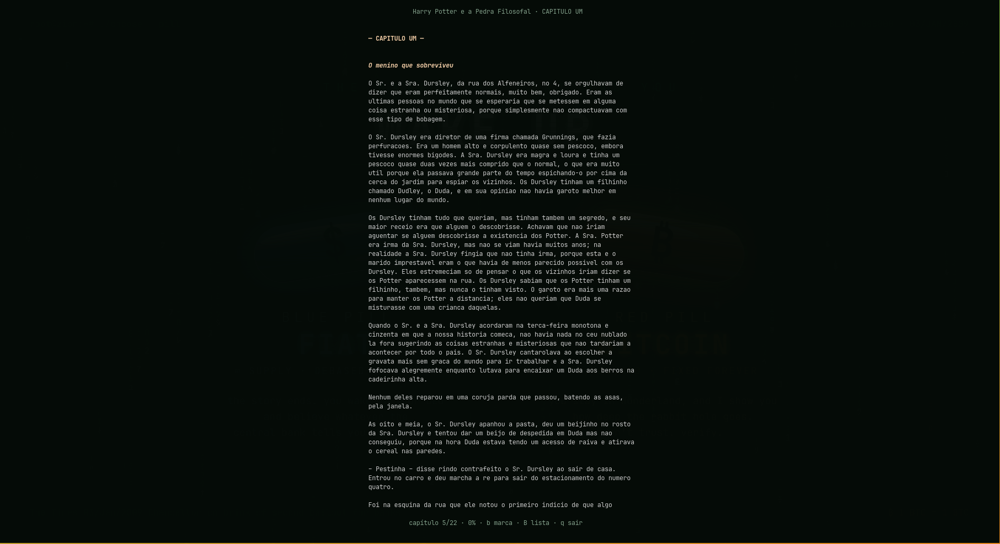

# tbook

Leitor de EPUB no terminal, escrito em Go. Abre arquivos `.epub`, lista capítulos, renderiza o texto em uma coluna confortável de ler e desenha as imagens do livro com blocos coloridos — tudo sem sair do terminal.



## Recursos

- Leitura de EPUB 2 e EPUB 3 direto no terminal (Bubble Tea + viewport).
- Navegação por capítulos com `←`/`→` (ou `h`/`l`), TOC e impressão de capítulo no stdout.
- Texto renderizado como Markdown via glamour, com tema embutido e largura máxima de 76 colunas centralizada.
- Imagens do livro convertidas para ANSI de 24 bits (blocos `▀`, dois pixels por caractere).
- Bookmarks persistentes por livro, com lista navegável e salto direto para o ponto marcado.
- Layout que se adapta ao redimensionamento do terminal.

## Instalação

Precisa de Go 1.27+ apenas para compilar. Com ele instalado:

```sh
go install github.com/bernardofernandezz/tui-ebook-reader/cmd/tbook@latest
```

O binário `tbook` vai para `$(go env GOPATH)/bin` — mantenha essa pasta no `PATH`.

### A partir do código

```sh
git clone https://github.com/bernardofernandezz/tui-ebook-reader
cd tui-ebook-reader
go build -o tbook ./cmd/tbook
```

O projeto não distribui livros: use seus próprios arquivos `.epub` (eles não são versionados).

## Uso

```sh
tbook livro.epub            # abre o leitor
tbook read livro.epub       # idem, de forma explícita
tbook toc livro.epub        # lista os capítulos numerados
tbook cat livro.epub -c 3   # imprime o capítulo 3 no stdout
tbook --help                # ajuda de qualquer comando
```

### Atalhos no leitor

| Tecla                     | Ação                                        |
| ------------------------- | ------------------------------------------- |
| `←` / `→` ou `h` / `l`    | capítulo anterior / próximo                 |
| `j` / `k` ou `↓` / `↑`    | rolar uma linha                             |
| `d` / `u`                 | meia página para baixo / para cima          |
| `espaço` / `f`            | avançar uma página                          |
| `pgup`                    | voltar uma página                           |
| `b`                       | marcar / desmarcar bookmark no capítulo     |
| `B`                       | abrir a lista de bookmarks                  |
| `q` ou `ctrl+c`           | sair                                        |

Na lista de bookmarks: `j`/`k` movem, `enter` salta para o ponto marcado e `esc` (ou `B`) fecha.

Os bookmarks ficam em `~/.config/tbook/bookmarks.json` (ou no diretório equivalente do seu sistema, via `os.UserConfigDir`), indexados pelo caminho absoluto do livro e indicados com `★` no cabeçalho.

## Como funciona

O código é organizado em `cmd/` + `internal/`, com responsabilidades separadas:

| Pacote                | Papel                                                                                           |
| --------------------- | ----------------------------------------------------------------------------------------------- |
| `internal/cli`        | Comandos (`read`, `toc`, `cat`) com Cobra; o comando raiz abre o leitor.                        |
| `internal/epub`       | Wrapper do parser `raitucarp/epub`: monta a lista de capítulos, extrai título/heading, resolve e cacheia imagens. |
| `internal/ui`         | TUI Bubble Tea: modos de leitura e bookmarks, viewport, layout centralizado, tema e render ANSI. |
| `internal/bookmarks`  | Persistência dos bookmarks em JSON, com toggle e ordenação por posição.                         |

Detalhes de implementação:

- **Capítulos**: documentos de conteúdo do manifesto viram capítulos na ordem de leitura; documentos muito curtos (capa, copyright) são ignorados e o título vem do primeiro heading do Markdown.
- **Renderização**: o Markdown passa pelo glamour com o tema embutido em `internal/ui/theme.json` (via `go:embed`). A largura de texto é limitada a 76 colunas e a coluna é centralizada no terminal; ao redimensionar, o capítulo é re-renderizado.
- **Imagens**: cada referência de imagem é substituída por uma versão reduzida (até 48×24) desenhada com o caractere `▀`, usando a cor do pixel de cima no texto e a do pixel de baixo no fundo — cores em RGB de 24 bits.
- **Bookmarks**: `internal/bookmarks` grava um JSON com capítulo, percentual de rolagem e rótulo; `b` alterna a marca do capítulo atual e `B` abre a lista.

### Estrutura do projeto

```
cmd/tbook/main.go          # entrada do binário
internal/cli/              # comandos Cobra (root, read, toc, cat)
internal/epub/             # parsing e modelo do livro
internal/ui/               # TUI, tema e renderização de imagens
internal/bookmarks/        # bookmarks em JSON
assets/image.png           # screenshot usado neste README
```

## Desenvolvimento

```sh
go run ./cmd/tbook seu-livro.epub   # roda sem gerar binário
go build ./...                      # compila todos os pacotes
go vet ./...                        # checagem estática
```

## Feito com

- [Bubble Tea](https://github.com/charmbracelet/bubbletea), [Bubbles](https://github.com/charmbracelet/bubbles) e [Lip Gloss](https://github.com/charmbracelet/lipgloss) — TUI.
- [Glamour](https://github.com/charmbracelet/glamour) — renderização de Markdown no terminal.
- [raitucarp/epub](https://github.com/raitucarp/epub) — parsing de EPUB.
- [Cobra](https://github.com/spf13/cobra) — linha de comando.
